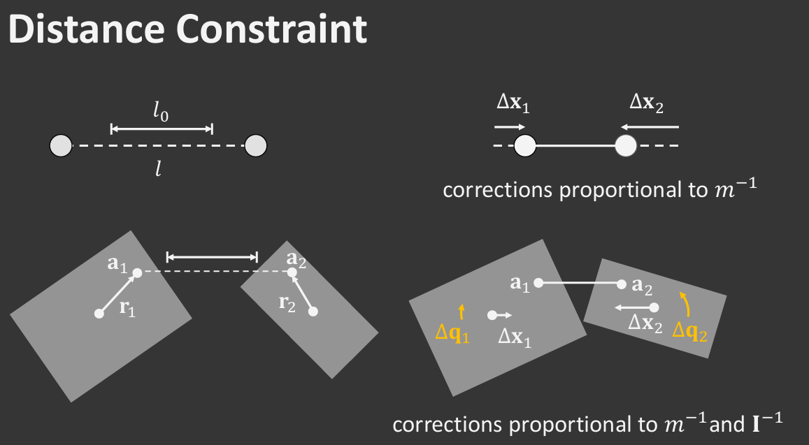

### 编译运行
- [github地址](https://github.com/Scyrc/rust-physical)
- 直接运行： target\release\目录下的 rust.exe
- 编译运行：
    ```bash
    cargo build
    cargo run
    ```
### 参考资料
- [Rust语法](https://course.rs/basic/intro.html)
- [bevy example](https://bevyengine.org/examples/)
- [Basic Rigid Body Simulation](!https://matthias-research.github.io/pages/tenMinutePhysics/09-xpbd.pdf)
- [XPBD](!https://matthias-research.github.io/pages/tenMinutePhysics/09-xpbd.pdf)
## 数学物理理解
- [无约束刚体模拟笔记](https://www.cnblogs.com/scyrc/p/16776824.html)
### 刚体模拟
- 基本属性

    |   属性   |  含义   |
    |:------:|:-----:|
    |   m    | 质心质量  |
    |   v    | 质心速度  |
    |   x    | 质心位置  |
    |   p    | 积分前位置 |
    |   q    | 旋转朝向  |
    | q_prev | 积分前旋转 |
    |   w    |  角速度  |
    |   I    | 转动惯量  |

- PBD 刚体模拟算法
    ```pseudocode
    while simulating:
        for all bodies i:           //积分
            step vi, xi
            step ωi, qi
        
        for all constraints C:      //求解约束
            solve(C, Δt)
    
        for all bodies i:           //更新速度
            update vi
            update ωi
    ```

    ```pseudocode
    //积分
    for all bodies 𝑖
        𝐩𝑖 ← 𝐱𝑖
        𝐯𝑖 ← 𝐯𝑖 +∆𝑡𝐠
        𝐱𝑖 ← 𝐱𝑖 +∆𝑡𝐯𝑖
        𝐪_prev ← 𝐪
        𝛚←𝛚+ℎ𝐈−1𝛕ext
        𝐪 ←𝐪+½ℎ𝐯[𝜔x,𝜔y,𝜔z,0]q
    ```
  
    ```pseudocode
    //基于求解后位置更新速度
    for all bodies 𝑖
        𝐯𝑖 ←(𝐱𝑖 −𝐩𝑖)/∆𝑡
        ∆𝐪 ←𝐪 * 𝐪_prev.inserve()
        𝛚←2[∆𝑞𝑥,∆𝑞𝑦,∆𝑞𝑧]/∆t
    ```
- XPBD 距离约束

- 限制物体1上a1和物体2上a2距离为l0.
  - r1为a1到质心向量，r1为a2到质心向量
  - n = (a2 - a1) / |a2 - a1|
  - C = l - l0

- 计算广义逆质量
$$
w_i \leftarrow m_i^{-1}+\left(\mathbf{r}_i \times \mathbf{n}\right)^{\mathrm{T}} \mathbf{I}_i^{-1}\left(\mathbf{r}_i \times \mathbf{n}\right)
$$

- 计算𝜆  (𝛼 physical inverse stiffness)
$$
\lambda \leftarrow-C \cdot\left(w_1+w_2+\frac{\alpha}{\Delta t^2}\right)^{-1}
$$
- 更新状态
  $$
  \begin{aligned}
  & \mathbf{x}_i \leftarrow \mathbf{x}_i \pm w_i \lambda \mathbf{n} \\
  & \mathbf{q}_i \leftarrow \mathbf{q}_i \pm \frac{1}{2} \lambda\left[\mathbf{I}_i^{-1}\left(\mathbf{r}_i \times \mathbf{n}\right), 0\right] \mathbf{q}_i
  \end{aligned}
  $$
